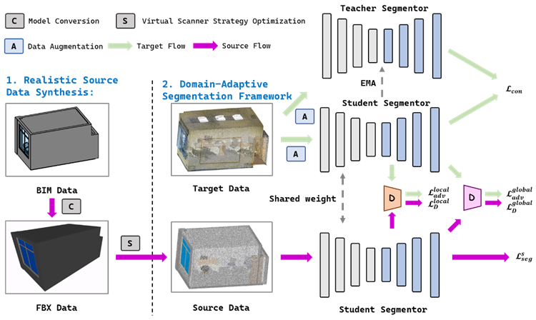

# Bridging the BIM-to-Scan Gap: Physically Grounded Virtual Scanning and Hierarchical Unsupervised Domain Adaptation for Point Cloud Semantic Segmentation

This is the official code repository for the paper "Bridging the BIM-to-Scan Gap: Physically Grounded Virtual Scanning and Hierarchical Unsupervised Domain Adaptation for Point Cloud Semantic Segmentation".

## 📋 Table of Contents

- [Introduction](#introduction)
- [Requirements](#requirements)
- [Installation](#installation)
- [Data Preparation](#data-preparation)
- [Usage](#usage)
- [Virtual Scan Simulator](#virtual-scan-simulator)
- [Project Structure](#project-structure)
- [Framework Overview](#framework-overview)

## Introduction

This project proposes a domain adaptation framework for point cloud semantic segmentation, aiming to bridge the domain gap between synthetic data generated from BIM (Building Information Modeling) and real scanned point clouds. Key features include:

- **Physically Grounded Virtual Scanning**: Generate realistic synthetic point cloud data from CAD models using our advanced virtual scan simulator (`tools/virtual_scan_simulator.py`). This tool simulates near-realistic LiDAR scanning effects, including occlusion simulation, multi-sensor intelligent layout, range noise, and random dropout, to bridge the gap between synthetic BIM data and real scanned point clouds.
- **Hierarchical Domain Adaptation**: Use multi-level adversarial training to bridge domain gaps
- **Attention Mechanisms**: Combine Point Transformer for powerful feature extraction
- **Unsupervised Learning**: Perform domain adaptation on target domain without annotations

## Requirements

- Python 3.9
- PyTorch 1.12
- CUDA (recommended 11.6+)
- Other dependencies (see Installation section)

## Installation

### 1. Clone the Repository

```bash
git clone <repository-url>
cd domain_adaptation
```

### 2. Create Virtual Environment

```bash
conda create -n domain_adaptation python=3.9
conda activate domain_adaptation
```

### 3. Install PyTorch

```bash
# Install PyTorch 1.12 according to your CUDA version
# For example, CUDA 11.6:
pip install torch==1.12.1+cu116 torchvision==0.13.1+cu116 --extra-index-url https://download.pytorch.org/whl/cu116
```

### 4. Install Other Dependencies

```bash
pip install numpy scikit-learn matplotlib tqdm pyyaml torch-points-kernels open3d
```

**Note**: `open3d` is required for the virtual scan simulator tool.

### 5. Compile CUDA Extensions

The project requires compiling the following CUDA extension modules:

#### Compile pointops2

```bash
cd lib/pointops2
python setup.py install
cd ../..
```

#### Compile fps_cuda

Install and compile fps_cuda from the GitHub repository:

```bash
git clone https://github.com/HaoRan-hash/fps_cuda.git
cd fps_cuda
python setup.py install
# or
pip install .
cd ..
```

**Note**: Compiling CUDA extensions requires a properly configured CUDA toolchain. If you encounter compilation issues, please ensure:
- CUDA version is compatible with PyTorch
- CUDA development toolkit is installed
- Environment variables are correctly set

## Data Preparation

### Data Directory Structure

```
data/
├── bim_scan/          # Source domain data (synthetic point clouds from BIM)
│   └── Area_*.npy    # Each file contains point cloud data (N, 7): xyz + rgb + label
├── stanford_indoor3d/ # Target domain data (real scanned point clouds)
│   └── Area_*.npy
└── bim_indoor3d/     # Other data
```

### Data Format

Each `.npy` file should contain an array of shape `(N, 7)`, where:
- First 3 columns: Point cloud coordinates (x, y, z)
- Middle 3 columns: RGB color values
- Last column: Semantic labels

### Class Definitions

The default configuration supports 13 classes:
```
['ceiling', 'floor', 'wall', 'beam', 'column', 'window', 'door', 
 'table', 'chair', 'sofa', 'bookcase', 'board', 'clutter']
```

## Usage

### Training

Train with hierarchical GAN for domain adaptation:

```bash
cd scripts
python train_att_hierarchical_gan.py \
    --model pointnet2_att_hierarchical_gan \
    --batch_size 8 \
    --learning_rate 0.001 \
    --d_lr 0.001 \
    --gpu 0 \
    --npoint 40000 \
    --test_area 5 \
    --n_epochs 50 \
    --source_data_root ../data/bim_scan/ \
    --target_data_root ../data/stanford_indoor3d/ \
    --log_dir att_hierarchical_gan \
    --lambda_adv 0.01 \
    --d_steps 3 \
    --discriminator_level_indices 1 2 3 \
    --warmup_epochs 5 \
    --exclude_classes board clutter
```

#### Key Training Parameters

- `--model`: Model name (default: `pointnet2_att_hierarchical_gan`)
- `--batch_size`: Batch size (default: 8)
- `--learning_rate`: Generator learning rate (default: 0.001)
- `--d_lr`: Discriminator learning rate (default: 0.001)
- `--npoint`: Number of points per sample (default: 40000)
- `--test_area`: Test area number (1-6, default: 5)
- `--n_epochs`: Number of training epochs (default: 50)
- `--lambda_adv`: Adversarial loss weight (default: 0.01)
- `--d_steps`: Number of discriminator updates per generator step (default: 3)
- `--discriminator_level_indices`: Discriminator level indices to use (default: [1,2,3])
  - 1: dec2 layer (local features)
  - 2: dec3 layer (mid-level features)
  - 3: dec4 layer (global features)
- `--warmup_epochs`: Number of epochs to train without adversarial loss (default: 5)
- `--exclude_classes`: Classes to exclude during training (default: board clutter)
- `--use_amp`: Use mixed precision training to save memory
- `--gradient_accumulation_steps`: Number of steps to accumulate gradients (for handling large batches)

### Testing

Test with trained model:

```bash
cd scripts
python test_semseg_att.py \
    --gpu 0 \
    --batch_size 16 \
    --num_point 40000 \
    --log_dir att_hierarchical_gan \
    --test_area 5 \
    --num_votes 3 \
    --visual \
    --exclude_classes board clutter
```

#### Key Testing Parameters

- `--log_dir`: Experiment log directory (should match training)
- `--test_area`: Test area number (default: 5)
- `--num_votes`: Number of voting aggregations during testing (default: 3, increase for better accuracy but slower)
- `--visual`: Whether to visualize results
- `--exclude_classes`: Should match training configuration

### Results

Training and testing results will be saved in:
```
log/sem_seg/<log_dir>/
├── train.log          # Training log
├── eval.txt           # Testing evaluation results
├── visual/            # Visualization results (if enabled)
└── *.pth              # Model checkpoints
```

## Virtual Scan Simulator

The `tools/virtual_scan_simulator.py` is a crucial tool for generating realistic synthetic point cloud data that closely mimics real LiDAR scanning effects. This tool is essential for bridging the domain gap between synthetic BIM data and real scanned point clouds.

### Features

- **Multi-Sensor Intelligent Layout**: Automatically plan optimal sensor positions for maximum coverage
- **Occlusion Simulation**: Precise ray-casting based occlusion detection using 3D voxel grids
- **Realistic Noise Simulation**: Add range noise and random dropout to simulate real sensor imperfections
- **Configurable Parameters**: Support for different LiDAR configurations (standard, high-resolution, indoor)
- **Batch Processing**: Process multiple point cloud files with resume functionality

### Basic Usage

Generate virtual scans from point cloud data:

```bash
cd tools
python virtual_scan_simulator.py \
    --input ../data/bim_indoor3d \
    --output ../data/bim_scan \
    --preset standard_lidar \
    --output_format ply \
    --max_sensors 6 \
    --min_coverage_threshold 0.85 \
    --voxel_size 0.05 \
    --max_range 10.0 \
    --fov_horizontal 360.0 \
    --fov_vertical 300.0 \
    --sensor_height 1.5 \
    --resume
```

### Key Parameters

- `--input`: Input point cloud folder or file path
- `--output`: Output directory for simulated scan results
- `--preset`: Preset configuration (`standard_lidar`, `high_resolution`, `indoor`)
- `--output_format`: Output format (`ply`, `pcd`, `txt`, `npy`)
- `--max_sensors`: Maximum number of sensors for multi-sensor layout
- `--min_coverage_threshold`: Minimum coverage threshold (0.0-1.0)
- `--voxel_size`: Voxel size for occlusion simulation
- `--max_range`: Maximum scan range in meters
- `--fov_horizontal`: Horizontal field of view in degrees
- `--fov_vertical`: Vertical field of view in degrees
- `--sensor_height`: Sensor height in meters
- `--resume`: Enable resume functionality to skip already processed files

### Advanced Features

- **Iterative Optimization**: Dynamically adjust sensor positions based on actual scan results
- **Multi-Processing**: Parallel processing of multiple files
- **Resume Support**: Automatically skip already processed files

For more details, see the tool's help:
```bash
python tools/virtual_scan_simulator.py --help
```

## Project Structure

```
domain_adaptation/
├── scripts/                    # Training and testing scripts
│   ├── train_att_hierarchical_gan.py  # Training script
│   └── test_semseg_att.py             # Testing script
├── models/                     # Model definitions
│   ├── pointnet2_att_hierarchical_gan.py  # Main model (hierarchical GAN + attention)
│   ├── pointnet2_sem_seg_att.py          # Attention-based segmentation model
│   ├── pointnet2_dawnet.py               # DAWNet model
│   └── discriminator.py                  # Discriminator definitions
├── network/                    # Network components
│   ├── generator.py            # Generator
│   ├── discriminator_out.py    # Output-level discriminator
│   └── domain_mix.py           # Domain mixing module
├── data_utils/                 # Data processing utilities
│   ├── S3DISDataLoader.py      # Data loader
│   ├── sim_scanner.py          # Virtual scanning simulator
│   └── transform.py            # Data transformations
├── utils/                      # Utility functions
│   ├── ema_model.py            # Exponential moving average model
│   ├── pseudo_label_generator.py  # Pseudo-label generation
│   └── prototype_estimator.py  # Prototype estimation
├── lib/                        # CUDA extension libraries
│   ├── pointops/               # Point operations CUDA extension
│   ├── pointops2/              # Point operations CUDA extension (enhanced)
│   └── pointgroup_ops/          # Point group operations CUDA extension
├── baseline/                   # Baseline method implementations
├── tools/                      # Auxiliary tools
│   ├── virtual_scan_simulator.py  # Multi-sensor virtual scan simulator (generates realistic synthetic scans)
│   └── view_npy_pointcloud.py     # Point cloud visualization tool
├── cfgs/                       # Configuration files
│   └── bim_config.yaml         # BIM configuration
├── figure/                     # Image resources
│   └── image.png               # Framework diagram
└── data/                       # Data directory
    ├── bim_scan/               # Source domain data
    └── stanford_indoor3d/      # Target domain data
```

## Framework Overview

The framework consists of two main stages:

### 1. Realistic Source Data Synthesis

Generate realistic synthetic point cloud data from CAD models:
- **Virtual Scan Simulation**: Use `tools/virtual_scan_simulator.py` to simulate near-realistic LiDAR scanning effects, including:
  - Multi-sensor intelligent layout planning
  - Ray-casting based occlusion detection
  - Range noise and random dropout simulation
  - Configurable sensor parameters (FOV, resolution, range)
- **Textured Point Cloud Generation**: Generate point clouds with realistic textures
- **Semantic Annotation**: Automatically generate semantic labels

### 2. Domain-Adaptive Segmentation Framework

Perform domain adaptation using hierarchical adversarial training:

- **Encoder-Decoder Architecture**: U-Net-based point cloud segmentation network
- **Attention Mechanisms**: Point Transformer for powerful feature extraction
- **Hierarchical Discriminators**:
  - **Feature-Level Discriminator**: Domain alignment at encoder feature level
  - **Output-Level Discriminator**: Domain alignment at segmentation output level
- **Multi-Level Adversarial Training**: Domain adaptation at multiple network levels simultaneously

The complete framework architecture is shown below:



For detailed description, please refer to `figure/image.png`.

## Key Features

### Hierarchical GAN Domain Adaptation

- Adversarial training at multiple network levels (local, mid-level, global) simultaneously
- Use WGAN-GP or LSGAN loss
- Configurable discriminator level selection

### Mean Teacher Consistency Regularization (Optional)

- Use exponential moving average teacher model to provide stable pseudo-labels
- Unsupervised consistency learning on target domain
- Note: May affect performance in domain adaptation tasks, enabled by default but can be disabled

### Pseudo-Label Generation

- Confidence-based pseudo-label generation
- Support for global or class-specific thresholds
- Periodic pseudo-label updates

### Data Augmentation

- Random rotation, flipping, jittering
- Voxelization downsampling
- TACM (Target-Aware Class Mixing) augmentation

## Troubleshooting

### CUDA Extension Compilation Failure

1. Check CUDA version: `nvcc --version`
2. Ensure CUDA version is compatible with PyTorch
3. Check environment variables: `CUDA_HOME`, `PATH`, `LD_LIBRARY_PATH`
4. Try cleaning and recompiling:
   ```bash
   cd lib/pointops2
   rm -rf build dist *.egg-info
   python setup.py install
   ```

### Out of Memory

- Reduce `--batch_size`
- Enable `--use_amp` for mixed precision training
- Increase `--gradient_accumulation_steps`
- Disable `--cache_data` (if enabled)

### Training Instability

- Adjust `--lambda_adv` (reduce adversarial loss weight)
- Increase `--warmup_epochs`
- Adjust learning rate
- Check data quality

---

**Note**: This project requires CUDA support and is recommended to run in an environment with NVIDIA GPU.
